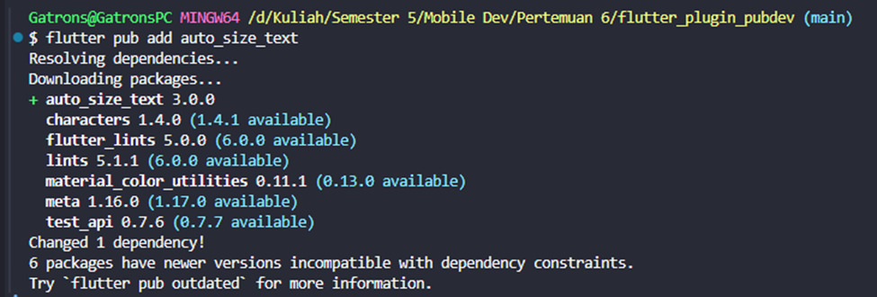
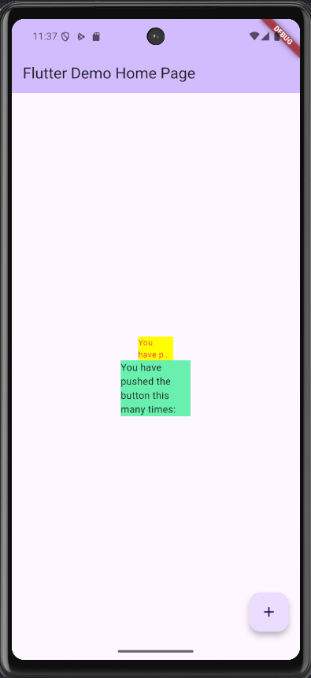

# 📱 Praktikum Flutter — Manajemen Plugin

**Mata Kuliah:** Pemrograman Mobile
**Nama:** Iga Ramadana Sahputra  
**NIM:** 2341760083  
**Kelas:** SIB 3C  
**No Absen:** 15

## **Repository:** [PMB_JS05 - Layout dan Navigasi](https://github.com/igaramadana/flutter_plugin_pubdev)

---

## Langkah 1: Buat Project Baru

## 

## Langkah 2: Menambahkan Plugin

```dart
flutter pub add auto_size_text
```

Plugin auto_size_text adalah package Flutter yang secara otomatis menyesuaikan ukuran font teks agar sesuai dengan batasan yang diberikan.

## Langkah 3: Buat file red_text_widget.dart

```dart
import 'package:flutter/material.dart';

class RedTextWidget extends StatelessWidget {
  const RedTextWidget({Key? key}) : super(key: key);

  @override
  Widget build(BuildContext context) {
    return Container();
  }
}
```

## Langkah 4: Tambah Widget AutoSizeText

```dart
return AutoSizeText(
      text,
      style: const TextStyle(color: Colors.red, fontSize: 14),
      maxLines: 2,
      overflow: TextOverflow.ellipsis,
);
```

Setelah menambahkan kode diatas akan mendapatkan error karena variabel text tidak dideklarasikan
Dart Compiler Tidak Menemukan Definisi
Compiler Dart mencari variabel text dalam scope:
✅ Local variables dalam method build - Tidak ada
✅ Instance variables dalam class RedTextWidget - Tidak ada
✅ Static variables - Tidak ada
✅ Global variables - Tidak ada
❌ Result: "Undefined name 'text'"

---

## Langkah 5: Buat Variabel text dan parameter di constructor

```dart
import 'package:flutter/material.dart';
import 'package:auto_size_text/auto_size_text.dart';

class RedTextWidget extends StatelessWidget {
  final String text;

  const RedTextWidget({Key? key, required this.text}) : super(key: key);

  @override
  Widget build(BuildContext context) {
    return AutoSizeText(
      text,
      style: const TextStyle(color: Colors.red, fontSize: 14),
      maxLines: 2,
      overflow: TextOverflow.ellipsis,
    );
  }
}
```

---

## Langkah 6: Tambahkan widget di main.dart

Buka file main.dart lalu tambahkan di dalam children: pada class \_MyHomePageState

```dart
Container(
   color: Colors.yellowAccent,
   width: 50,
   child: const RedTextWidget(
             text: 'You have pushed the button this many times:',
          ),
),
Container(
    color: Colors.greenAccent,
    width: 100,
    child: const Text(
           'You have pushed the button this many times:',
          ),
),
```

---

## Output yang dihasilkan dari praktikum


